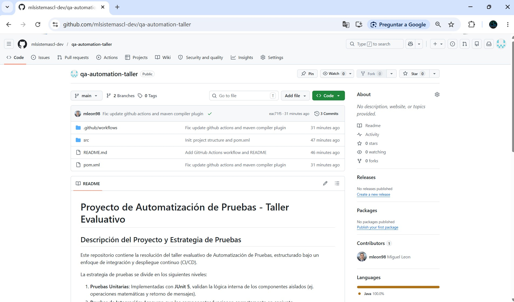

# Proyecto de Automatización de Pruebas - Taller Evaluativo

## Descripción del Proyecto y Estrategia de Pruebas

Este repositorio contiene la resolución del taller evaluativo de Automatización de Pruebas, estructurado bajo un enfoque de integración y despliegue continuo (CI/CD). 

La estrategia de pruebas se divide en los siguientes niveles:
1. **Pruebas Unitarias:** Implementadas con **JUnit 5**, validan la lógica interna de los componentes aislados (ej. operaciones matemáticas y retorno de mensajes).
2. **Pruebas de Integración:** Aseguran que los componentes funcionen correctamente en conjunto.
3. **Pruebas de Aceptación (Acceptance Tests):** Validan el comportamiento esperado del sistema antes de un despliegue en ambiente de pruebas.

El proyecto está configurado con **Maven** y gestiona sus dependencias (JUnit, Selenium) a través del archivo `pom.xml`. El control de versiones sigue el flujo **GitFlow**, trabajando sobre las ramas `main` y `develop`.

## Ejecución de las Pruebas y Pipelines

### Ejecución Local
Para ejecutar las pruebas de forma local, asegúrese de tener **Maven** y **Java 17** instalados, luego ejecute:

- **Pruebas Unitarias:** `mvn clean test`
- **Pruebas de Integración:** `mvn failsafe:integration-test failsafe:verify`

### Pipeline CI/CD (GitHub Actions)
El pipeline automatizado está definido en `.github/workflows/ci.yml` y se dispara al realizar un `push` o `pull_request` a las ramas `main` o `develop`. Consta de dos etapas (stages):

1. **Build and Test (Actividad 2):** Descarga el código, configura JDK 17, compila el proyecto y ejecuta las pruebas unitarias y de integración automáticamente.
2. **Deploy to Test Environment (Actividad 3):** Simula un despliegue bajo la estrategia **Blue-Green Deployment**. Ejecuta pruebas de aceptación en el ambiente inactivo (Green) y, si son exitosas, conmuta el tráfico hacia este nuevo ambiente. Si fallan, cuenta con un mecanismo de **Rollback** automático, manteniendo el tráfico en el ambiente estable (Blue).

## Evidencias (Capturas de Pantalla)

A continuación, se adjuntan las capturas solicitadas en las actividades:

### Actividad 1: Repositorio y POM.xml configurado

### Actividad 2: Ejecución de Pipeline CI (Build y Pruebas)

### Actividad 3: Pipeline de Despliegue y Rollback

